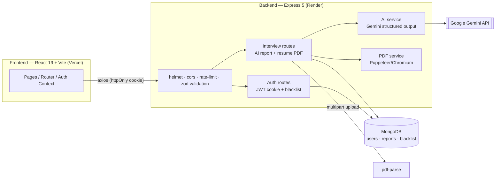

# Resume Analyzer (AI Interview Coach)

[](https://github.com/AdityaKumar3594/Resume-Analyzer/actions/workflows/ci.yml) [](https://resume-analyzer-nine-xi.vercel.app/) [](https://resume-analyzer-3e1q.onrender.com) [](https://www.mongodb.com/) [](LICENSE)

**Resume Analyzer** is a full-stack AI interview prep platform that analyzes a candidate's resume and job description to generate a tailored interview strategy, skill gaps, and a readiness roadmap—then produces a polished PDF resume.

---

## Table of Contents
1. [Overview](#overview)
2. [Architecture](#architecture)
3. [Tech Stack](#tech-stack)
4. [Key Features](#key-features)
5. [Live Demo](#live-demo)
6. [Installation](#installation)
7. [Running with Docker](#running-with-docker)
8. [Usage](#usage)
9. [API Reference & Docs](#api-reference--docs)
10. [Testing](#testing)
11. [Project Structure](#project-structure)
12. [Screenshots](#screenshots)
13. [Future Improvements](#future-improvements)
14. [Author](#author)

---

## Overview
**Target Users:** Job seekers, students, and professionals preparing for interviews.  
**Problem Solved:** Manually mapping job requirements to personal experience is slow and error-prone. This app automates analysis and provides actionable prep steps, personalized questions, and a resume PDF.

---

## Architecture



---

## Tech Stack

**Frontend**
- React 19 (Vite)
- React Router
- SCSS
- Axios

**Backend**
- Node.js + Express
- MongoDB + Mongoose
- JWT + httpOnly Cookies (Auth) with token blacklisting
- Zod request validation
- Helmet, CORS and tiered rate limiting (auth / AI endpoints)
- Multer (PDF-only file upload, 3MB limit)
- pdf-parse (resume text extraction)
- Puppeteer / Chromium (PDF generation on Render)
- Google GenAI + Zod (schema-validated structured AI responses)
- Swagger / OpenAPI (interactive API docs)
- Jest + Supertest + mongodb-memory-server (API test suite)

---

## Key Features
- Authentication (register, login, logout, get-me) with JWT httpOnly cookies and logout token blacklisting
- AI Interview Report: match score, technical + behavioral questions, skill gaps, and a day-wise readiness roadmap
- Resume PDF Generator with professional formatting (cached production browser for fast repeat renders)
- All Reports Dashboard with quick access and history
- Hardened API: centralised error handling, request validation, security headers, brute-force and AI-quota rate limits
- Health check endpoint (`GET /api/health`) for uptime monitoring

---

## Live Demo

- Frontend: https://resume-analyzer-nine-xi.vercel.app
- API: https://resume-analyzer-3e1q.onrender.com (docs at `/api/docs`, health at `/api/health`)

**Demo account**
- Email: `demo@resumeanalyzer.dev`
- Password: `demo1234`

(The login page has a *“Try the demo account”* button that fills these in.)

---

## Installation

### 1) Clone
```bash
git clone https://github.com/AdityaKumar3594/Resume-Analyzer.git
cd Resume-Analyzer
```

### 2) Backend Setup
```bash
cd Backend
npm install
```

Create `Backend/.env` (see `.env.example`):
```env
MONGO_URI=your_mongodb_uri
JWT_SECRET=your_jwt_secret
GOOGLE_GENAI_API_KEY=your_google_genai_key
PORT=3000
CLIENT_URL=http://localhost:5173
NODE_ENV=development
# Optional Gemini model overrides (defaults shown)
GEMINI_REPORT_MODEL=gemini-2.5-flash
GEMINI_RESUME_MODEL=gemini-2.5-flash
```

Optionally seed the demo account:
```bash
npm run seed
```

Run backend:
```bash
npm run dev
```

### 3) Frontend Setup
```bash
cd ../Frontend
npm install
```

Create `Frontend/.env`:
```env
VITE_API_URL=http://localhost:3000
```

Run frontend:
```bash
npm run dev
```

---

## Running with Docker

The whole stack (API + Vite dev frontend + MongoDB) starts with one command:

```bash
GOOGLE_GENAI_API_KEY=your_key docker compose up --build
```

- Frontend → http://localhost:5173
- API → http://localhost:3000 (`/api/health`, `/api/docs`)
- MongoDB → localhost:27017 (persisted in the `mongo-data` volume)

---

## Usage
1. Register or login (or use the demo account).
2. Upload your resume **or** write a quick self-description.
3. Paste a job description.
4. Generate the interview report.
5. Review questions, skill gaps, roadmap.
6. Download the resume PDF.

---

## API Reference & Docs

Interactive OpenAPI docs are served by the API itself:

- **Swagger UI:** `/api/docs`
- **OpenAPI spec (JSON):** `/api/docs.json`
- **Health:** `GET /api/health`

**Auth**
- `POST /api/auth/register` — rate limited (20 / 15 min)
- `POST /api/auth/login` — rate limited (20 / 15 min)
- `GET /api/auth/logout`
- `GET /api/auth/get-me`

**Interview** *(all rate limited to 10 generations / 15 min)*
- `POST /api/interview` — `multipart/form-data`: `resume` (PDF ≤ 3MB), `jobDescription`, `selfDescription`
- `GET /api/interview/`
- `GET /api/interview/report/:interviewId`
- `POST /api/interview/resume/pdf/:interviewReportId`

All errors share a consistent shape: `{ "success": false, "message": "…" }`.

---

## Testing

The API has an end-to-end test suite (Jest + Supertest) running against an in-memory MongoDB, with the Gemini service mocked — no API key or network needed.

```bash
cd Backend
npm test            # full suite (28 tests)
npm run test:watch  # watch mode
npm run test:coverage
```

CI (GitHub Actions) runs the backend tests plus frontend lint and build on every push and pull request.

---

## Project Structure

```
Resume-Analyzer/
+- .github/workflows/        CI (backend tests, frontend lint+build)
+- Backend/
¦  +- src/
¦  ¦  +- app.js              Express app: security, rate limits, docs, health
¦  ¦  +- config/             MongoDB connection
¦  ¦  +- controllers/        auth + interview
¦  ¦  +- docs/               OpenAPI spec (swagger-jsdoc)
¦  ¦  +- middlewares/        auth, error, validation, rate limit, upload
¦  ¦  +- models/             users, interview reports, token blacklist
¦  ¦  +- routes/             auth + interview (with OpenAPI annotations)
¦  ¦  +- scripts/            demo-account seed
¦  ¦  +- services/           Gemini + Puppeteer
¦  ¦  +- validations/        zod schemas
¦  +- tests/                 Jest + Supertest suite
¦  +- server.js
+- Frontend/
¦  +- src/
¦  ¦  +- features/
¦  ¦  ¦  +- auth/
¦  ¦  ¦  +- interview/
¦  ¦  +- app.routes.jsx
¦  ¦  +- App.jsx
¦  ¦  +- main.jsx
¦  +- style.scss
+- docker-compose.yml        api + frontend + mongo
+- Dockerfile
+- LICENSE
```

---

## Screenshots

Coming soon — see the [live demo](#live-demo).

---

## Future Improvements
- Multi-resume versioning
- Role-specific interview templates (SWE, PM, Data, etc.)
- Export report as PDF
- Analytics for improvement tracking
- Team/coach collaboration mode

---

## Author
**Aditya Kumar**
